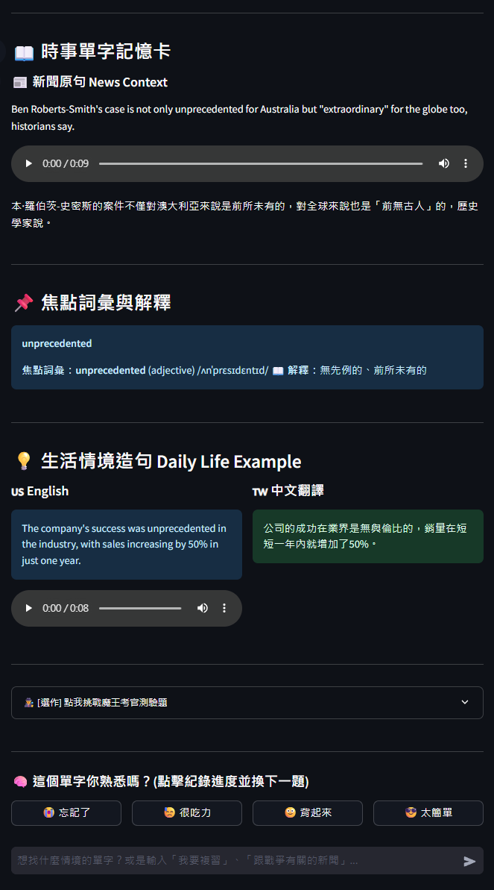
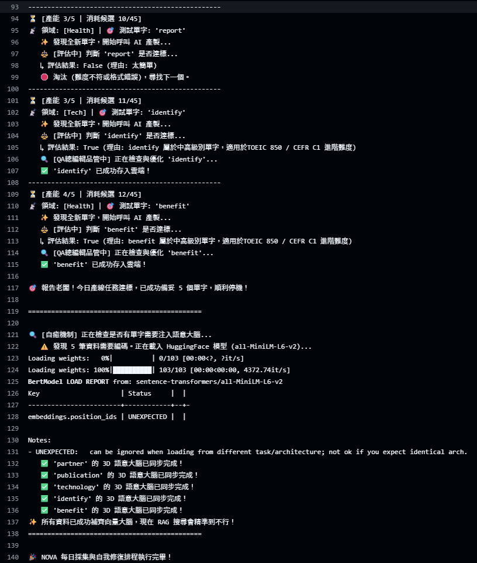

# 🌍 NOVA | Agentic News-Driven Vocabulary Builder


> 「NOVA 不僅是一個單字學習工具，更是一座具備時效感知與自我迭代能力的自動化資訊流。」


[](https://opensource.org/licenses/MIT)

## 🏛️ 系統理念 (System Philosophy)

**「為何命名為 NOVA？」**
NOVA 取自 **N**ews-driven **O**ptimized **V**ocabulary **A**gent（新聞驅動的最佳化單字代理）。同時，"Nova" 在天文學中代表著爆發的「新星」，象徵著這套系統能如同新星般，在學習者的腦海中瞬間點亮並刻印那些晦澀難懂的高階單字。

NOVA 是一個結合 Agentic Workflow (代理人工作流)、雲端無伺服器架構與 SRS 間隔重複演算法的智能時事單字庫。

在 NOVA 的設計中，資料不只是靜態的儲存，而是一個具備完整生命週期的流動體：從 BBC 原始新聞的**「萃取 (Extraction)」**，經過 LangGraph 多代理架構的**「轉化與品質審查 (Transformation & QA)」**，最終透過 SM-2 演算法沉澱為使用者的**「長期記憶 (Retention)」**。本專案將 AI 視為系統底層的協作微服務 (Microservices)，專注於定義高品質的資料邊界與自動化排程，實現真正的零維護 (Zero-Maintenance) 學習產線。

## ✨ 核心架構與 Agentic Workflow (Core Features)

### 0. 📸 系統展示 (System Showcase)

<p align="center">
  
</p>

<p align="center">
  
  &nbsp;
  
</p>


### 1. 🤖 狀態機與多代理協作大腦 (Multi-Agent State Machine)

**a. 後端資料準備**

本專案捨棄傳統的單一 Prompt 生成，採用 **LangGraph** 構建了基於狀態機 (State-Machine) 的四節點 AI 協作管線。每個 Agent 各司其職，並具備條件分流與品質控管機制：

> **workflow**：`[新聞輸入]` ➔ ⚖️ `評估員` ➔ (若達標) ➔ 👨‍🏫 `教師` ➔ 📝 `考官` ➔ 🔍 `QA 總編輯` ➔ `[入庫]`

* **⚖️ 評估員 (Assessor - 難度守門員)**：
    執行「及早短路 (Early Short-Circuit)」機制。嚴格過濾基礎詞彙，僅放行符合 CEFR C1 / TOEIC 850 標準的進階單字，有效節省下游 Agent 的運算資源與 API 成本。
* **👨‍🏫 教師 (Teacher - 語境建構者)**：
    具備「語塊感知 (Chunk-Aware)」能力。不僅解釋單字，若偵測到該單字在原句中屬於特定片語或固定搭配 (Lexical Chunks)，會自動擴大教學邊界，生成符合真實語境的記憶卡。
* **📝 考官 (Examiner - 測驗生成器)**：
    運用 Prompt Engineering 限制干擾選項 (Distractors) 的結構與詞性，動態生成四選一的情境填空題。
* **🔍 總編輯 (Reviewer - 線性潤飾與品管)**：
    負責生產線的最後一哩路 (Linear Refinement)。直接審查並潤飾前述產出的中文翻譯流暢度與測驗邏輯，同時嚴格保護前端 UI 所需的 Markdown 解析格式不被破壞。

**b. 前端資料呈現**

介面採用對話式驅動，由agent判斷使用者輸入意圖，提供根據SRS演算法從候選單字庫提取單字的 **複習** 功能，以及RAG系統的語意搜尋，可以針對單字或是新聞內容作搜尋：

> **workflow**：`[對話輸入]` ➔ 🧠 `意圖路由` ➔ 📝 `複習` / 🔍 `搜尋` ➔ 🎨 `單字卡介面`

* **🧠 意圖路由 (Intent Routing)**：
    根據使用者輸入對話，由agent判斷執行複習功能或是語意查找。
* **📝 複習 (Review)**：
    使用SRS演算法，動態計算符合單字，與新單字一併形成候選資料庫，從中隨機抽取單字，製作今日單字卡。
* **🔍 搜尋 (Search)**：
    先由agent轉譯原始語句為適合查詢之關鍵字，以RAG功能搜尋符合單字或新聞例句。
* **🎨 單字卡介面 (UI)**：
    透過streamlit介面展示結構化排版的單字資訊。

### 2. 📰 時事驅動的資料管線 (News-Driven ETL Pipeline)
每日自動解析 BBC RSS 新聞流，透過 Pandas 進行輕量級 ETL 處理，並與本地端的高階詞彙表進行交集比對，確保萃取出的教材皆帶有最新的國際時事語境。

### 3. ⏳ 科學記憶引擎 (SM-2 SRS Algorithm)
內建 SuperMemo-2 間隔重複演算法。系統會動態計算 `Quality` (回饋品質)、`Interval` (間隔天數) 與 `Ease Factor` (輕鬆度乘數)，在遺忘曲線的臨界點精準推送複習任務，將短期記憶轉化為長期記憶。

### 4. 🗄️ 3D 語意金庫 (Supabase Vector DB) & RAG System
* 儲存 `word_embedding` (單字面)、`context_embedding` (時事面)、`example_embedding` (生活面)，將單字立體化。
* 使用 `all-MiniLM-L6-v2` 進行高效率的語意編碼。

### 5. ⚙️ 自動化與配額管理 (Automation & Quota Management)
藉由 GitHub Actions 部署每日 Cron Job。系統具備防禦性的「自我配額管理 (Quota Management)」意識，會主動向資料庫查詢當日已生成的教材數量，避免 API 帳單超支，實現真正的零維護 (Zero-Maintenance) 運作。

## 🗺️ 系統架構簡述

1. **採集層 (Collector)**: 隨機挑選 3 個新聞頻道 -> 各抓取 15 筆新聞 -> 全局洗牌。
2. **過濾層 (Filter)**: 讀取本地 `vocab_advanced_clean.csv` 字典檔，與新聞進行交集比對，抓出進階詞彙。
3. **生成層 (Generator)**: 啟動 LangGraph，AI 員工依序接力完成「評估 -> 教學 -> 測驗 -> 審查」的自動化流程。
4. **存儲層 (Storage)**: 寫入 Supabase (`llm_generation_cache` & `user_srs_progress`)。
5. **展示層 (Frontend)**: 使用者透過 Streamlit 網頁進行每日任務與 SRS 複習。

## 🛠️ 技術堆疊 (Tech Stack)

* **Frontend UI**: Streamlit, gTTS (語音合成), Regex (動態語塊挖空)
* **AI & LLM**: LangGraph, LangChain, Groq API (llama-3.3-70b-versatile)
* **Data Engineering**: Pandas, BeautifulSoup4, Feedparser
* **Frontend**: Streamlit
* **Vector Database**: Supabase (PostgreSQL + pgvector)
* **Embedding Model**: HuggingFace (`all-MiniLM-L6-v2`)
* **CI/CD**: GitHub Actions

## 📂 檔案結構 (Architecture Directory)

```text
NOVA-Agentic-Vocabulary-Builder/
├── .github/workflows/
│   └── daily_cron.yml           # GitHub Actions 自動化排程劇本
├── data/
│   ├── vocab_advanced_clean.csv # 進階單字篩選字典 (本地端快取)
│   └── init.sql                 # 初始化supabase的SQL腳本
├── app.py                       # Streamlit 前端：SRS 演算法實作與互動介面
├── collector.py                 # 後端大腦：RSS 爬蟲、LangGraph 產線、資料庫同步
├── requirements.txt             # 環境相依套件清單
├── README.md                    # 系統架構說明文檔
└── pic/                         # 系統架構圖與前後端運行截圖
```

## 🚀 快速啟動 (Quick Start)

### 1. 取得專案 (Clone Repository)
```bash
git clone https://github.com/YuJunWang/NOVA-Agentic-Vocabulary-Builder.git
cd NOVA-Agentic-Vocabulary-Builder
```

### 2. 建置虛擬環境 (Environment Setup)
建議使用 Python 3.10 以確保套件相容性。
```bash
python -m venv venv
venv\Scripts\activate       # Windows
# source venv/bin/activate  # MacOS / Linux

pip install -r requirements.txt
```

### 3. Supabase 資料庫初始化 (Database initialization)
請先到 [supabase](https://supabase.com/) 申請一個project，取得ID及Key

👉 **點擊此處查看並取得完整的 [Supabase 初始化 SQL 腳本 (data/init.sql)](./data/init.sql)**

**建置步驟：**
1. 點擊上方連結進入 `init.sql` 檔案。
2. 複製檔案內的全部內容。
3. 進入您的 Supabase 專案後台，開啟 **SQL Editor**。
4. 貼上腳本並點擊 `Run`，即可一鍵完成所有資料庫與 AI 搜尋引擎的架構設定！


### 4. 配置金鑰防護罩 (Secret Management)
本專案嚴格分離「後端引擎」與「前端 UI」的環境變數。

接著在本地專案根目錄建立以下兩個檔案：

**`.env` (供後端 `collector.py` 讀取)**
```text
GROQ_API_KEY=gsk_your_api_key_here
SUPABASE_URL=https://your-project-id.supabase.co
SUPABASE_KEY=your_anon_public_key
TARGET_DAILY_COUNT=5
```

**`.streamlit/secrets.toml` (供前端 `app.py` 讀取)**
```toml
SUPABASE_URL = "https://your-project-id.supabase.co"
SUPABASE_KEY = "your_anon_public_key"
GROQ_API_KEY = "gsk_your_api_key_here"
```


### 5. 啟動系統 (Run the System)

**啟動資訊產線 (後端大腦測試)：**
```bash
python collector.py
```

**啟動互動介面 (前端學習空間)：**
```bash
streamlit run app.py
```

## 👨‍💻 作者 (Author)
**Yu-Jun Wang**
*Architecting Data Flow | AI-Augmented Developer*
* [GitHub Profile](https://github.com/YuJunWang)

## 📄 授權條款 (License)

本專案採用 **[MIT License](LICENSE)** 授權。
你可以自由地使用、複製、修改與散佈本專案，但請保留原作者的版權聲明。詳細條款請參閱 `LICENSE` 檔案。