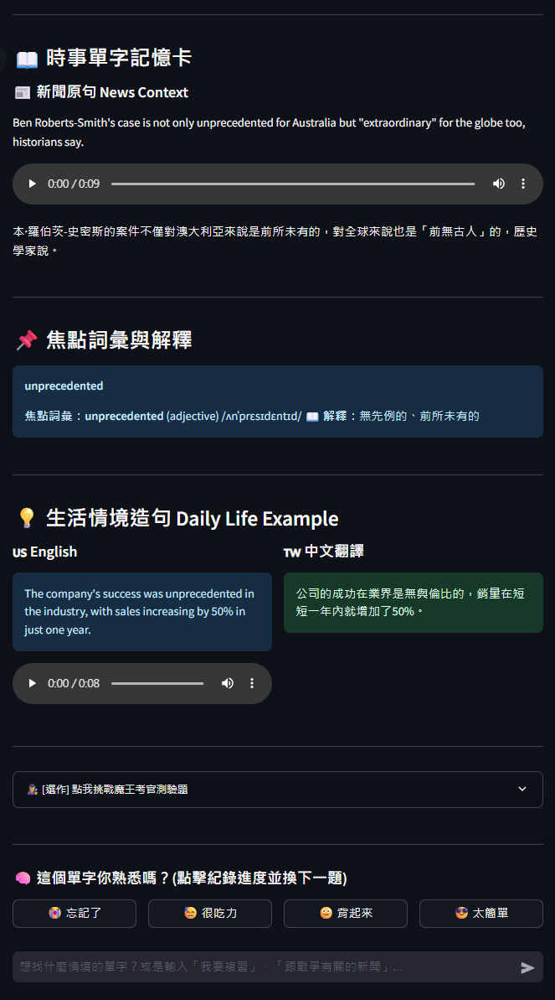
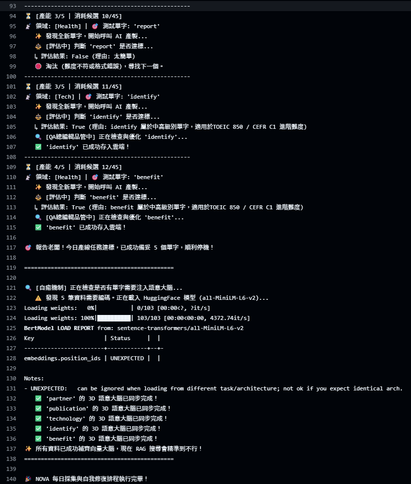

# 🌍 NOVA | Agentic News-Driven Vocabulary Builder

結合 BBC 即時時事、LangGraph 多代理人產線與 SuperMemo-2 (SM-2) 間隔重複演算法的自動化高階英文單字學習系統。


[](https://opensource.org/licenses/MIT)

---

## 📌 為什麼做這個專案？

死背單字書常常遇到兩個痛點：**「脫離真實語境」**與**「缺乏複習機制」**。

NOVA 的設計理念是讓學習素材直接來自「真實世界的最新事件」。系統每天透過 GitHub Actions 自動抓取 BBC 新聞，由 LangGraph 狀態機產線篩選出進階商務與時事單字，自動提煉情境例句與測驗題；最後將單字與情境向量化存入 Supabase，結合 SM-2 間隔重複演算法推送每日複習，達成全自動、無人值守的單字學習流。

---

## 📸 系統展示 (Showcase)

<p align="center">
  
</p>

<p align="center">
  
  &nbsp;
  
</p>

---

## ⚙️ 核心架構與工作流 (Workflow)

### 1. 後端：LangGraph 四節點自動化產線 (`collector.py`)

為了避免單一 Prompt 同時處理過多任務導致輸出品質不穩，後端採用 **LangGraph 狀態機** 將單字生成拆解為四個專責節點：

```text
[BBC 新聞輸入] ➔ ⚖️ Assessor ➔ (達標) ➔ 👨‍🏫 Teacher ➔ 📝 Examiner ➔ 🔍 Reviewer ➔ [入庫 Supabase]
                     └─ (未達標 ➔ 早期終止 END)
```

- **⚖️ Assessor (難度過濾)**：
  預先排除長度小於 4 的基礎詞，並以 **TOEIC 750+ / CEFR B2-C1** 為基準判斷詞彙是否具備商務或學術價值。未達標者觸發 Conditional Edge 提早短路（Early Exit），大幅節省後續 LLM 呼叫成本與 API Token。
- **👨‍🏫 Teacher (教材生成)**：
  具備語塊感知（Lexical Chunks）能力。若單字在原句中屬於特定片語或固定搭配，會自動擴大教學邊界，生成符合該語境的雙語解釋與生活例句。
- **📝 Examiner (情境出題)**：
  以原始新聞語境為靈感，動態生成四選一英文填空題與中文解析，並嚴格要求干擾選項（Distractors）詞性與結構對稱。
- **🔍 Reviewer (品管與純句萃取)**：
  校對 JSON 格式與繁體中文語意流暢度，同時萃取去除標記的純英文句子，供後續向量編碼使用。

### 2. 前端：對話式意圖路由與學習空間 (`app.py`)

前端採用 Streamlit 打造，整合自然語言路由與記憶演算法：

- **🧠 意圖路由 (Intent Router)**：
  透過 Pydantic Structured Output 分析使用者輸入，自動分流至「查單字」、「依情境/時事語意搜尋」或「SRS 複習」。
- **🔍 向量檢索 (RAG System)**：
  使用 HuggingFace `all-MiniLM-L6-v2` 與 Supabase pgvector，支援針對單字面（Word）、時事背景（Context）與生活例句（Example）進行多維度相似度搜尋。
- **⏳ SM-2 間隔重複複習 (Spaced Repetition)**：
  內建 SuperMemo-2 演算法。依據使用者答題品質（Quality 0~5）動態計算 Ease Factor 與下次複習天數，在遺忘臨界點精準推送。

---

## 🛡️ 工程設計亮點

1. **Groq 速率保護 (Rate Limit & Retry Protection)**：
   針對 Groq 免費方案 8,000 TPM 上限，ChatGroq 實作 SDK 級重試（`max_retries=5`）、產線成功間隔節流（2s），以及捕捉 429 例外時自動冷卻 10 秒後重試同一個單字的容錯機制。
2. **配額感知與冪等性 (Quota Awareness)**：
   排程啟動時主動查詢 Supabase 當日已建立的單字量，若已達 `TARGET_DAILY_COUNT` 則自動跳過，避免重複生成浪費資源。
3. **非同步語意大腦同步 (Embedding Synchronizer)**：
   產線主流程順利完成後，自動掃描未完成向量編碼的記錄，批次補上 3 向語意 Embedding，維持資料庫搜尋品質。

---

## 🛠️ 技術堆疊 (Tech Stack)

| 領域 | 技術 / 工具 |
| :--- | :--- |
| **前端介面** | Streamlit, gTTS (語音合成) |
| **AI / 多代理人** | LangGraph, LangChain, Groq API (`openai/gpt-oss-120b`，支援 `GROQ_MODEL` 環境變數動態切換) |
| **資料工程** | Pandas, BeautifulSoup4, Feedparser |
| **向量資料庫** | Supabase (PostgreSQL + pgvector) |
| **Embedding 模型** | HuggingFace (`sentence-transformers/all-MiniLM-L6-v2`) |
| **CI / CD 排程** | GitHub Actions (每日定時 Cron Job) |

---

## 📂 專案結構

```text
NOVA-Agentic-Vocabulary-Builder/
├── .github/workflows/
│   └── daily_cron.yml           # GitHub Actions 每日自動化排程
├── data/
│   ├── vocab_advanced_clean.csv # 本地進階單字比對詞庫
│   └── init.sql                 # Supabase 資料庫與向量 RPC 初始化腳本
├── app.py                       # Streamlit 前端：意圖路由、SRS 複習與 RAG 檢索
├── collector.py                 # 後端產線：RSS 爬蟲、LangGraph 狀態機、向量同步
├── requirements.txt             # 鎖定版本的依賴清單
└── README.md                    # 專案說明文件
```

---

## 🚀 快速啟動 (Quick Start)

### 1. 複製專案
```bash
git clone https://github.com/YuJunWang/NOVA-Agentic-Vocabulary-Builder.git
cd NOVA-Agentic-Vocabulary-Builder
```

### 2. 建立虛擬環境並安裝套件
建議使用 Python 3.10：
```bash
python -m venv venv
venv\Scripts\activate       # Windows
# source venv/bin/activate  # MacOS / Linux

pip install -r requirements.txt
```

### 3. 初始化 Supabase 資料庫
1. 至 [Supabase](https://supabase.com/) 建立專案並取得 Project URL 與 API Key。
2. 進入 Supabase 後台的 **SQL Editor**。
3. 複製 [`data/init.sql`](./data/init.sql) 內容並執行，一鍵建立資料表與向量搜尋 RPC 函數。

### 4. 設定環境變數

在專案根目錄建立以下設定檔：

**`.env` (供後端 `collector.py` 讀取)**
```text
GROQ_API_KEY=gsk_your_api_key_here
SUPABASE_URL=https://your-project-id.supabase.co
SUPABASE_KEY=your_anon_public_key
HF_TOKEN=your_huggingface_token

# 每日目標採集單字數
TARGET_DAILY_COUNT=5

# 可選：指定 Groq 模型（預設為 openai/gpt-oss-120b）
# GROQ_MODEL=qwen/qwen3.6-27b
```

**`.streamlit/secrets.toml` (供前端 `app.py` 讀取)**
```toml
SUPABASE_URL = "https://your-project-id.supabase.co"
SUPABASE_KEY = "your_anon_public_key"
GROQ_API_KEY = "gsk_your_api_key_here"

# 可選：指定 Groq 模型（預設為 openai/gpt-oss-120b）
# GROQ_MODEL = "qwen/qwen3.6-27b"
```

### 5. 執行系統

**測試後端採集產線：**
```bash
python collector.py
```

**啟動前端學習介面：**
```bash
streamlit run app.py
```

---

## 👨‍💻 作者 (Author)

**Yu-Jun Wang**
* [GitHub Profile](https://github.com/YuJunWang)

---

## 📄 授權條款 (License)

本專案採用 **[MIT License](LICENSE)** 授權。